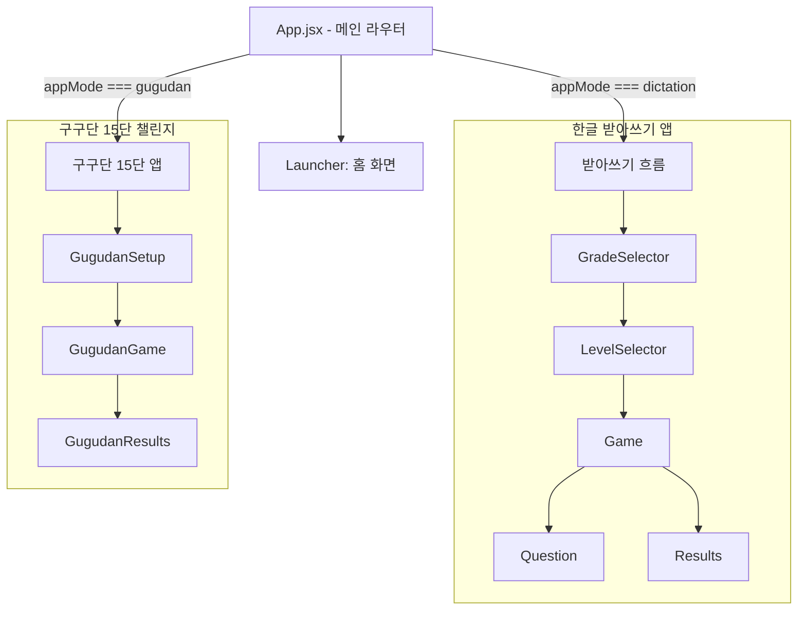
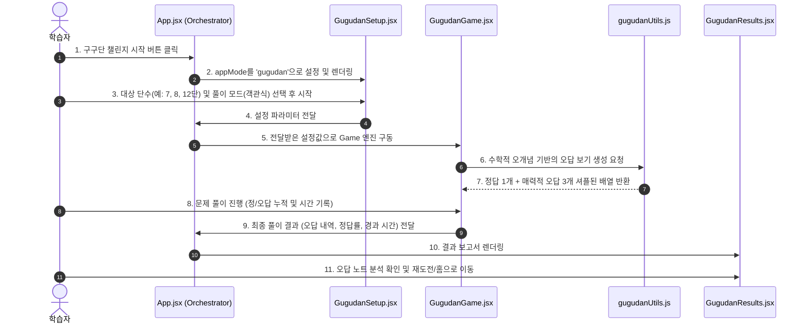

# 🏗 Architecture & Context

본 문서는 '한글 받아쓰기'와 '구구단 15단'을 아우르는 통합 학습 플랫폼의 설계 철학, 데이터 흐름, 그리고 컴포넌트 간 관계를 기록한 아키텍처 가이드입니다.

---

## 🏛 전체 시스템 아키텍처 개요

본 프로젝트는 React 19와 Vite 7 기반의 Single Page Application(SPA)으로, 전형적인 **단방향 데이터 흐름(Unidirectional Data Flow)**을 따릅니다. 
메인 엔트리포인트인 `App.jsx`가 **메인 컨트롤러(State Orchestrator)** 역할을 수행하며, 하위 앱(`dictation` 및 `gugudan`)의 진입 및 상태 전환을 통제합니다.

### 🧩 컴포넌트 계층 및 폴더 구조

---

## 🔄 핵심 데이터 흐름 (Data Flow)

학습자가 메인 화면에서 구구단 앱을 선택하고, 문제 풀이를 마친 후 결과 분석 화면에 도달하는 시퀀스는 다음과 같습니다:

---

## 🎨 아키텍처 의사결정 기록 (ADR - Architectural Decision Records)

### 1. 두 개의 독립된 서브시스템 구조 (Coexistence of Sub-domains)
- **결정**: 기존의 '받아쓰기' 컴포넌트들과 새로 추가되는 '구구단' 컴포넌트들을 물리적인 디렉터리(`src/components/gugudan/`)로 격리하고, 상위 라우터 `App.jsx`에서 `appMode` 상태값에 따라 분기 처리합니다.
- **이유 (Trade-off)**:
  - *장점*: 서로 다른 도메인 간의 코드 간섭이 0에 수렴하여 디버깅 및 확장이 극도로 용이해지며, 겹치지 않는 스타일시트(`Gugudan.css`) 분리로 오염을 예방할 수 있습니다.
  - *단점*: 메인 홈으로 나가는 공통 네비게이션 헤더의 상태 관리가 약간 추가되지만, 이는 `App.jsx`에서 간단한 단방향 콜백 함수로 가볍게 해결할 수 있습니다.

### 2. 수학적 오개념(Distractor) 기반 오답 생성기 도입
- **결정**: 단순히 `Math.random()`으로 무작위 숫자를 만들어 내는 방식 대신, 곱셈 가감산 에러, 연산자 혼동, 자릿수 전치 등 실제 인지적 에러 유형에 기반한 **정밀 오답 풀(Pool) 추출 알고리즘**을 도입합니다.
- **이유**:
  - *장점*: 단순 난수(예: $7 \times 8$의 보기가 $56, 120, 3, 94$)는 직관적으로 답을 고르기 쉽기 때문에 실질적인 곱셈 암산 훈련이 되지 않습니다. $56, 49, 63, 64$와 같이 정답 주변의 곱이나 자릿수 오류를 보기로 제공해야 고난도 훈련이 성사됩니다.
